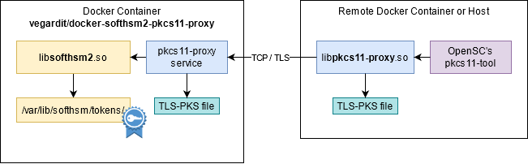

# vegardit/docker-softhsm2-pkcs11-proxy <a href="https://github.com/vegardit/docker-softhsm2-pkcs11-proxy/" title="GitHub Repo"></a>

[](https://github.com/vegardit/docker-softhsm2-pkcs11-proxy/actions?query=workflow%3ABuild)
[](#license)
[](https://hub.docker.com/r/vegardit/softhsm2-pkcs11-proxy)
[](https://hub.docker.com/r/vegardit/softhsm2-pkcs11-proxy)
[](CODE_OF_CONDUCT.md)

1. [What is it?](#what-is-it)
1. [Docker image tagging scheme](#tags)
1. [Usage](#usage)
1. [License](#license)


## <a name="what-is-it"></a>What is it?

> **SoftHSM has been developed for development purposes only. Don't use in production!**

A multi-arch Docker image to run a virtual HSM (Hardware Security Module) network service based on [SoftHSM2](https://github.com/softhsm/SoftHSMv2) and
[pkcs11-proxy](https://github.com/smallstep/pkcs11-proxy).

Automatically rebuilt **weekly** to include the latest OS security fixes.

Client applications can communicate with the HSM via TCP/TLS using libpkcs11-proxy.so and an OpenSSL TLS-PSK:




## <a name="tags"></a>Docker image tagging scheme

|Tag|Description|Base Image
|-|-|-
|`:latest` <br> `:latest-alpine` | weekly build of the latest available SoftHSM release | alpine:3
|`:latest-debian` | weekly build of the latest available SoftHSM release | debian:stable-slim
|`:develop` <br> `:develop-alpine` | weekly build of the development branch | alpine:3
|`:develop-debian` | weekly build of the development branch | debian:stable-slim
|`:2.x` <br> `:2.x-alpine` | weekly build of the latest minor version of the respective <br> major release, e.g. `2.x` may contain release `2.6` | alpine:3
|`:2.x-debian` | weekly build of the latest minor version of the respective <br> major release, e.g. `2.x` may contain release `2.6` | debian:stable-slim

See all tags at https://hub.docker.com/r/vegardit/softhsm2-pkcs11-proxy/tags


## <a name="usage"></a>Usage

### Service Configuration

SoftHSMv2 internal storage is located at `/var/lib/softhsm/`.

The PKCS11 Daemon listens on port `2345` by default.

The docker image can be configured via the following environment variables:


|Name                      | Comment | Default
|-                         |-        |-
|INIT_SH_FILE              | Path to a file that shall be automatically executed on container start. | [`/opt/init-token.sh`](image/init-token.sh)
|TOKEN_AUTO_CREATE         | If a token shall be created on container start if it is not already existing based on the following values: `0` = no or `1` = yes | `1`
|TOKEN_LABEL               | Name of the token to auto-create. |`Test Token`
|TOKEN_USER_PIN            | User pin of the token to auto-create. |`1234`
|TOKEN_USER_PIN_FILE       | Path to file containing the user pin. Value in this file takes precedence over TOKEN_USER_PIN variable. | empty
|TOKEN_SO_PIN              | SO (Security Officer/Admin user) pin of the token to auto-create. |`5678`
|TOKEN_SO_PIN_FILE         | Path to file containing SO pin. Value in the file takes precedence over TOKEN_SO_PIN variable. | empty
|TOKEN_IMPORT_TEST_DATA    | Specifies if a test certificate shall be imported: `0` = no or `1` = yes | `0`
|PKCS11_DAEMON_SOCKET      | Socket the PKCS11 daemon listens. |`tls://0.0.0.0:2345`
|PKCS11_PROXY_TLS_PSK_FILE | File containing the PKCS11 daemon's OpenSSL TLS-PSK (pre-shared key). |`/opt/test.tls.psk`
|SOFTHSM_STORAGE           | Specifies what backend shall be used to store the token: `file` or `db` (aka `sqlite`) | `file`


Examples:

1. Running with default test configuration:
    ```bash
    docker run -it -name softhsm vegardit/docker-softhsm2-pkcs11-proxy
    ```

1. Running with custom settings:
    ```bash
    docker run -it --rm \
       -name softhsm-server \
       # define a custom token name:
       -e TOKEN_LABEL="MyToken" \
       # use custom pins stored in files:
       -e TOKEN_USER_PIN_FILE="/mnt/config/token_user_pin" \
       -e TOKEN_SO_PIN_FILE="/mnt/config/token_so_pin" \
       # use a custom TLS pre-shared key:
       -e PKCS11_PROXY_TLS_PSK_FILE="/mnt/config/pkcs11_proxy.psk" \
       # expose port 2345
       -p 2345:2345 \
       # mount config and data directories:
       -v /path/to/config:/mnt/config:ro \
       -v /path/to/data:/var/lib/softhsm:rw \
       vegardit/docker-softhsm2-pkcs11-proxy:latest
    ```

1. Same as docker-compose file:

    ```yaml
    version: '3.8'

    services:

      softhsm-server:
        image: vegardit/softhsm2-pkcs11-proxy:latest
        environment:
          TOKEN_LABEL: MyToken # define a custom token name
          TOKEN_USER_PIN_FILE: /mnt/config/token_user_pin # use custom pin stored in file
          TOKEN_SO_PIN_FILE: /mnt/config/token_so_pin     # use custom pin stored in file
          TOKEN_IMPORT_TEST_DATA: 0 # don't import test data
          PKCS11_PROXY_TLS_PSK_FILE: /mnt/config/pkcs11_proxy.psk # use a custom TLS pre-shared key
        ports:
          - 2345:2345
        volume:
          /path/to/config:/mnt/config:ro    # mount config directory readonly
          /path/to/data:/var/lib/softhsm:rw # mount data directory writable
        deploy:
          restart_policy:
            condition: on-failure
            delay: 5s
    ```


### Client Usage Example

This is a simple exercise to get you familiar with how a client container can interact remotely with the SoftHSM via the PKCS11 proxy

1. Download one of the example dockerfiles [client.alpine.Dockerfile](client.alpine.Dockerfile) or [client.debian.Dockerfile](client.debian.Dockerfile).

2. Build the image using:

    ```bash
    $ docker build -f /path/to/Dockerfile --tag softhsm-client .
    ```

3. Start the docker images:

    ```bash
    # create a docker network through which both containers can communicate
    $ docker network create softhsm-net

    # start the SoftHSM server in test mode:
    $ docker run -it --rm \
        --net softhsm-net \
        --hostname softhsm-server \
        vegardit/softhsm2-pkcs11-proxy:latest

    # in a second terminal window start the client:
    $ docker run -it --rm \
        --net softhsm-net \
        -e PKCS11_PROXY_SOCKET=tls://softhsm-server:2345 \
        -e PKCS11_PROXY_TLS_PSK_FILE=/opt/test.tls.psk \
        softhsm-client
    ```

4. Test network communication

    In the shell of the client container you can now test connectivity to the server using
    the [pkcs11-tool](https://linux.die.net/man/1/pkcs11-tool).

    ```bash
    #
    # first define an alias that loads the required proxy module
    #
    $ alias p11tool='pkcs11-tool --module /usr/local/lib/libpkcs11-proxy.so'

    #
    # show all slots
    #
    $ p11tool --list-slots
      # output:
      Available slots:
      Slot 0 (0x3e2d07e4): SoftHSM slot ID 0x3e2d07e4
        token label        : Test Token
        token manufacturer : SoftHSM project
        token model        : SoftHSM v2
        token flags        : login required, rng, token initialized, PIN initialized, other flags=0x20
        hardware version   : 2.6
        firmware version   : 2.6
        serial num         : a96de792be2d07e4
        pin min/max        : 4/255
      Slot 1 (0x1): SoftHSM slot ID 0x1
        token state:   uninitialized

    #
    # generate and store a new key pair
    #
    $ p11tool --keypairgen --key-type RSA:2048 --label "My Key" --token-label "Test Token" --login --pin 1234
      # output:
      Key pair generated:
      Private Key Object; RSA
        label:      My Key
        ID:         01
        Usage:      decrypt, sign, unwrap
      Public Key Object; RSA 2048 bits
        label:      My Key
        ID:         01
        Usage:      encrypt, verify, wrap

    #
    # show all public objects in token "Test Token"
    #
    $ p11tool --list-objects --token-label "Test Token"
      # output:
      Public Key Object; RSA 2048 bits
        label:      My Key
        ID:         01
        Usage:      encrypt, verify, wrap

    #
    # show all objects in token "Test Token"
    #
    $ p11tool --list-objects --token-label "Test Token" --login --pin 1234
      # output:
      Private Key Object; RSA
        label:      My Key
        ID:         01
        Usage:      decrypt, sign, unwrap
      Public Key Object; RSA 2048 bits
        label:      My Key
        ID:         01
        Usage:      encrypt, verify, wrap

    #################################
    # sign some data with the new key
    #################################
    #
    # 1. create a file to sign
    $ echo "Hello World!" > message.txt

    # 2. list available algorithms to sign data
    $ p11tool --list-mechanisms | grep -P "RSA.*sign"
      # output:
      Using slot 0 with a present token (0x5bb016b2)
        MD5-RSA-PKCS, keySize={512,16384}, sign, verify
        RSA-PKCS, keySize={512,16384}, encrypt, decrypt, sign, verify, wrap, unwrap
        RSA-PKCS-PSS, keySize={512,16384}, sign, verify
        RSA-X-509, keySize={512,16384}, encrypt, decrypt, sign, verify
        SHA1-RSA-PKCS, keySize={512,16384}, sign, verify
        SHA256-RSA-PKCS, keySize={512,16384}, sign, verify
        SHA384-RSA-PKCS, keySize={512,16384}, sign, verify
        SHA512-RSA-PKCS, keySize={512,16384}, sign, verify

    # 3. sign the data with the newly created key
    $ p11tool --sign --id 1 --mechanism SHA256-RSA-PKCS \
         --token-label "Test Token" --pin 1234 \
         --input-file message.txt \
         --output-file message.txt.sig
      # output:
      Using signature algorithm SHA256-RSA-PKCS

    #################################
    # verify the message signature
    #################################
    # 1. extract the public key
    $ p11tool --read-object --type pubkey --label "My Key" --token-label "Test Token" > mykey.pub.der

    # 2. convert the public key to PEM format
    $ openssl rsa -inform DER -outform PEM -in mykey.pub.der -pubin > mykey.pub.pem
      # output:
      writing RSA key

    # 3. verify the signature
    $ openssl dgst -keyform PEM -verify mykey.pub.pem -sha256 -signature message.txt.sig message.txt
      # output:
      Verified OK
    ```


## <a name="resources"></a>Resources

- SoftHSM:
  - website: https://www.softhsm.org/
  - sources: https://github.com/softhsm/SoftHSMv2
  - tutorials:
    - [SoftHSM2 first steps to create slots](https://verschlüsselt.it/softhsm2-first-steps/)
- pkcs11-proxy:
  - sources: https://github.com/scobiej/pkcs11-proxy/tree/osx-openssl1-1 (SUNET/pkcs11-proxy plus OpenSSL 1.1 support)
  - sources: https://github.com/SUNET/pkcs11-proxy (fork with most changes)
  - sources: https://github.com/kedros-as/pkcs11-proxy (most recently updated fork)
  - sources: https://github.com/iksaif/pkcs11-proxy (original)
- pkcs11-tool:
  - sources: https://github.com/Mastercard/pkcs11-tools
  - documentation: https://linux.die.net/man/1/pkcs11-tool
  - tutorials:
    - [Show slot and token info with OpenSC pkcs11-tool](https://verschlüsselt.it/show-slot-and-token-info-with-pkcs11-tool/)
    - [Generate RSA, ECC and AES keys with OpenSC pkcs11-tool](https://verschlüsselt.it/generate-rsa-ecc-and-aes-keys-with-opensc-pkcs11-tool/)
    - [Export a RSA / ECC public key with OpenSC pkcs11-tool](https://verschlüsselt.it/export-a-rsa-ecc-public-key-with-opensc-pkcs11-tool/)
    - [Using the SmartCard-HSM with ECC and OpenSC](https://www.smartcard-hsm.com/2014/08/22/using-smartcard-hsm-with-ecc-and-opensc.html)
    - [OpenSC test Sign, Verify, Encipher and Decipher from commandline with OpenSSL CLI ](https://gist.github.com/Jakuje/5a993d2b2d8a9cac35203599e49e6831)


## <a name="license"></a>License

All files in this repository are released under the [Apache License 2.0](LICENSE.txt).

Individual files contain the following tag instead of the full license text:
```
SPDX-License-Identifier: Apache-2.0
```

This enables machine processing of license information based on the SPDX License Identifiers that are available here: https://spdx.org/licenses/.
